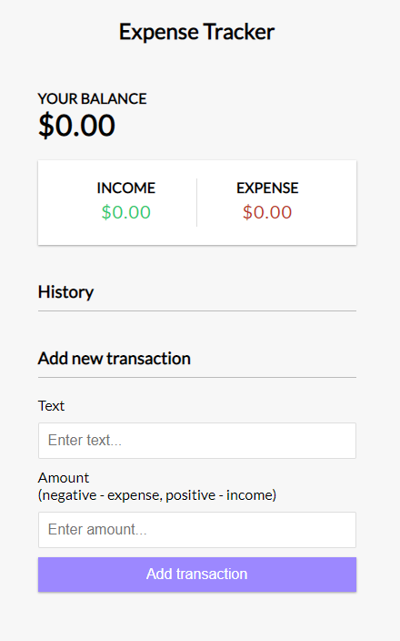

# Expense-Tracker

Simple project using js methods, like as reduce(), filter(), map()
Also this app uses local storage

In this application the user can add or delete transactions in two categories: 
income/expense, after which he receives the total balance

[DEMO](https://shymba.github.io/Expense-Tracker/)